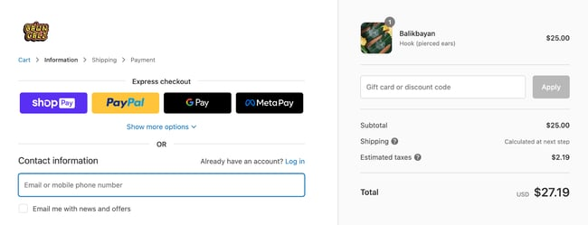
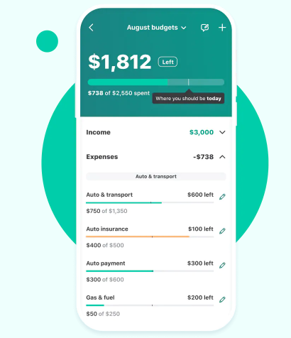
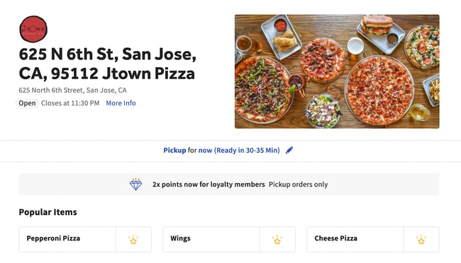
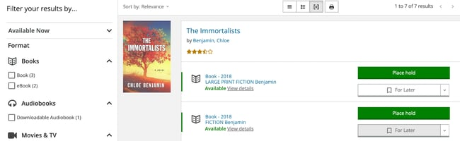

# Project-Mock-Portfolio

# Contributors : Self

# Description
Hello! This is Jaswinder Singh and my portfolio is about the projects I have worked on. I currently work for Mock Reasearch and been working for 2 years. I have created various projects/apps for my clients which includes an app for Ecommerce business, and app for Finance, an app for Restaurant and an app for Library. See images below in Deployed Projects section.  
Worked with HTML, CSS, Javascript, NodeJS, ReactJS and other web technologies.

## Link to my portfolio

 https://jaswindersinghsaini.github.io/project-mock-portfolio/

## Deployed Projects
Below are some of my deployed projects:
* My Portfolio 

    </a>

* Ecommerce App 

    </a>
* Finance App 

    </a>
* Restaurant App 

     </a>
* Library App 

     </a>

### Technologies Used
    - HTML
    - CSS
    - Javascript

### Installation

 - Clone the repository
 - Navigate to the top directory
 - Open the `index.html` in the browser

### Usage

The Apps/projects can be used to perform multiple activities such as buying at ecommerce website, finance calculator, restaurant oredering, choosing library books online etc.

#### License 
 MIT (https://choosealicense.com/licenses/mit/)
